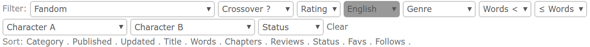

# [Fanfiction.net: Filter and Sorter](https://github.com/Nellius/UserScripts/tree/master/Fanfiction.net-Filter-and-Sorter)

## Description

Add filters and additional sorters to author page of Fanfiction.net.

[\[Install\]](https://github.com/Nellius/UserScripts/raw/master/Fanfiction.net-Filter-and-Sorter/fas.user.js) [\[Source\]](https://github.com/Nellius/UserScripts/blob/master/Fanfiction.net-Filter-and-Sorter/fas.user.js)

### Filters by

- Fandom
- Crossover
- Rating
- Language
- Genre
- Word count greater than
- Word count less or equal
- Character A
- Character B
- Status

### Additional sorters

- Favs
- Follows

### Screenshot

## Compatible

* [Tampermonkey](https://chrome.google.com/webstore/detail/tampermonkey/dhdgffkkebhmkfjojejmpbldmpobfkfo) on [Chromium](https://www.chromium.org/Home) desktop browser.
